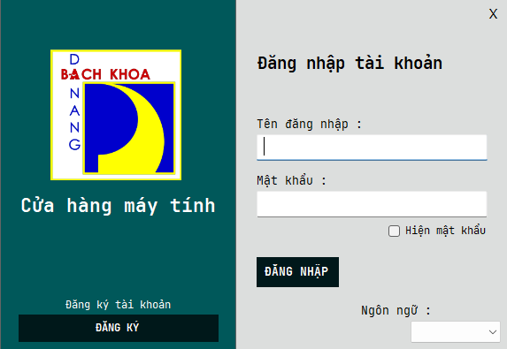
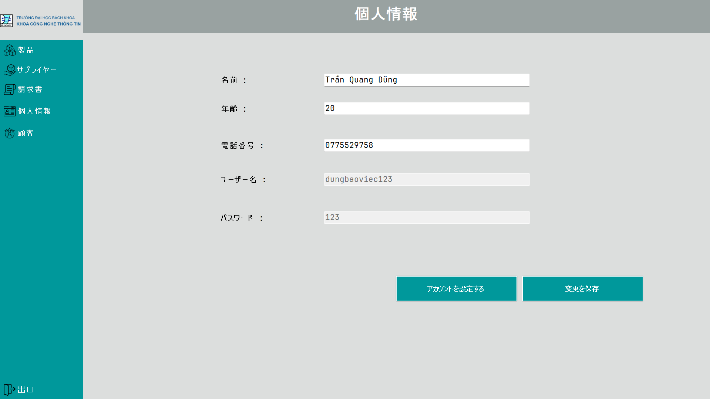
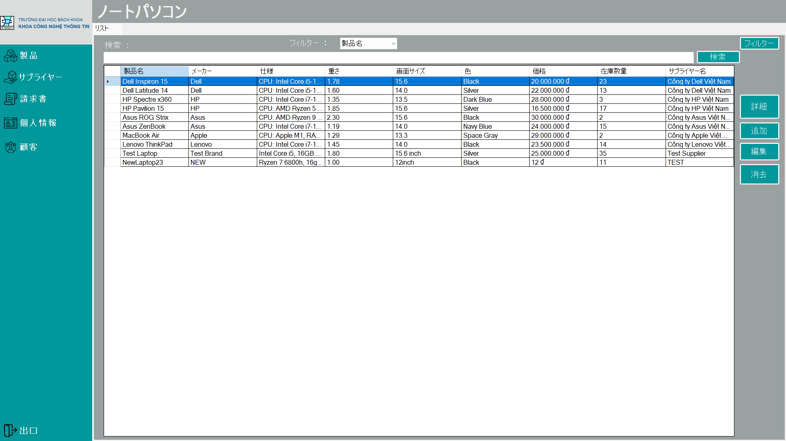
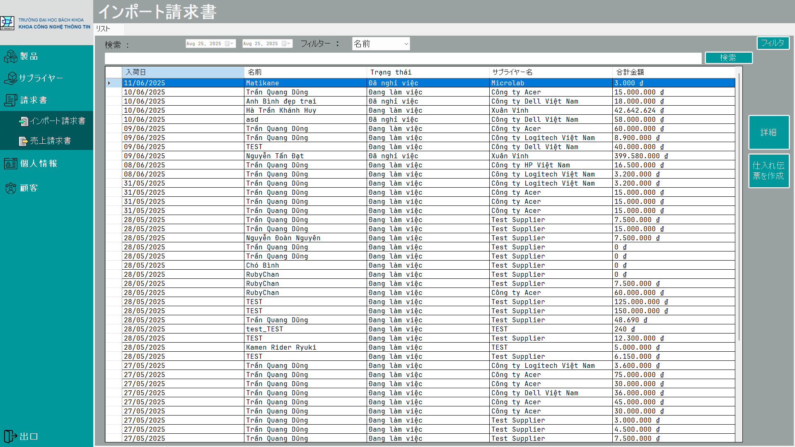
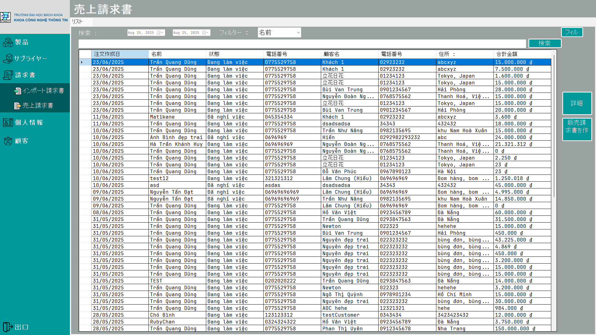
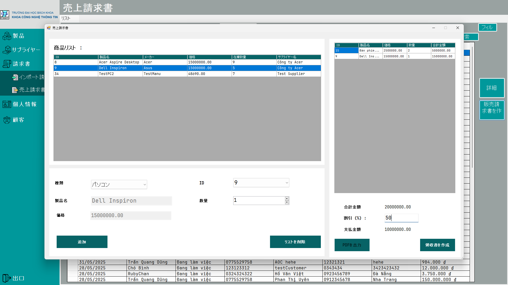

# Quản Lý Cửa Hàng Máy Tính (PBL3) / パソコンショップ管理 (PBL3)

## 🇻🇳 Giới thiệu

Đây là dự án PBL3 xây dựng hệ thống quản lý cửa hàng máy tính, phát triển bằng ngôn ngữ C# trên nền tảng Windows Forms. Dự án hỗ trợ các chức năng như quản lý sản phẩm, quản lý khách hàng, nhân viên, đơn hàng và báo cáo doanh thu.

**Cấu trúc dự án:**
- `Gwenchana.sln`: File solution cho Visual Studio.
- `Gwenchana/`: Thư mục chứa mã nguồn chính.
    - `BussinessLogic/`: Xử lý nghiệp vụ.
    - `DataAccess/`: Truy cập dữ liệu.
    - `GUI/`: Giao diện người dùng.
    - `Pictures/`, `Resources/`, `Properties/`: Tài nguyên hình ảnh và cấu hình.
    - `sssss.sql`: File script cơ sở dữ liệu.
    - `App.config`, `packages.config`, `Gwenchana.csproj`, `Program.cs`: Các file cấu hình và khởi động dự án.

**Hướng dẫn sử dụng:**
1. Clone repo về máy.
2. Mở file `Gwenchana.sln` bằng Visual Studio 2022 hoặc mới hơn.
3. Đảm bảo đã khởi tạo database theo script `sssss.sql`.
4. Build và chạy dự án.

---

## 🇯🇵 日本語の紹介

これはPBL3プロジェクトであり、C#およびWindows Formsを使用して開発されたパソコンショップ管理システムです。本プロジェクトは、商品管理、顧客・スタッフ管理、注文処理、売上レポートなどの機能をサポートしています。

**プロジェクト構成:**
- `Gwenchana.sln`：Visual Studioソリューションファイル
- `Gwenchana/`：メインソースコードのディレクトリ
    - `BussinessLogic/`：ビジネスロジック
    - `DataAccess/`：データアクセス層
    - `GUI/`：ユーザーインターフェース
    - `Pictures/`, `Resources/`, `Properties/`：画像素材と設定ファイル
    - `sssss.sql`：データベーススクリプト
    - `App.config`, `packages.config`, `Gwenchana.csproj`, `Program.cs`：設定および起動ファイル

**利用手順:**
1. このリポジトリをクローンしてください。
2. `Gwenchana.sln`をVisual Studio 2022以降で開いてください。
3. `sssss.sql`スクリプトを使ってデータベースを初期化してください。
4. プロジェクトをビルドして実行してください。

---

> **Lưu ý / 注意:**  
> Danh sách file và thư mục có thể chưa đầy đủ do giới hạn API.  
> ファイルやディレクトリの一覧はAPIの制限により完全ではない場合があります。  
> Vui lòng xem chi tiết tại / 詳細はこちら:  
> https://github.com/UmaMusumeEnjoyer/PBL3_DUT_Quan_ly_cua_hang_may_tinh/tree/master/Gwenchana
>
> ---

## 📷 Hình ảnh chương trình / プログラム画面

### 1. Giao diện đăng nhập / ログイン画面

### 2. Màn hình chính (Nhân viên) / メイン画面（スタッフ）

### 3. Giao diện quản lý hàng hoá / 商品管理画面

### 4. Giao diện quản lý hoá đơn nhập / 仕入れ請求管理画面

### 5. Giao diện quản lý hoá đơn xuất / 出荷請求管理画面

### 6. Giao diện tạo hoá đơn xuất / 出荷請求作成画面

### 7. Giao diện lựa chọn khách hàng / 顧客選択画面

### 8. Hoá đơn xuất dưới dạng PDF / PDF形式の出荷請求書

### 9. Giao diện quản lý doanh thu (Admin) / 売上管理画面（管理者）
.png)

